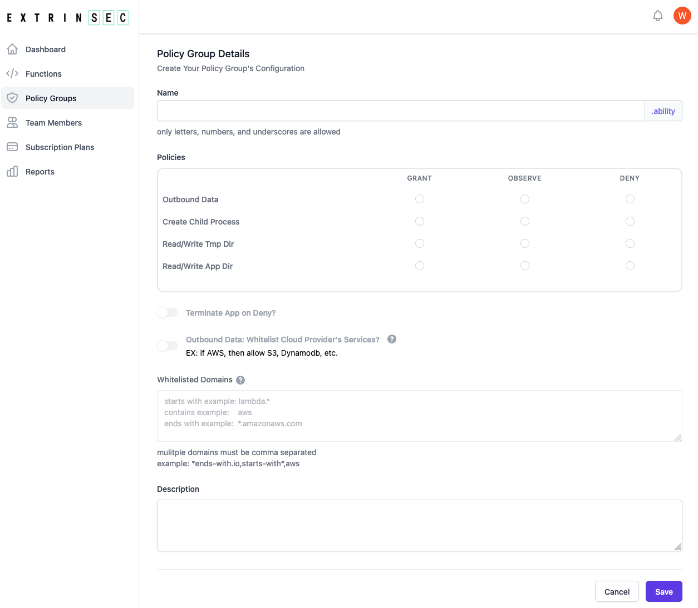

<a href="https://www.extrinsec.com">
  <picture>
    <source media="(prefers-color-scheme: dark)" srcset="https://cdn.extrinsec.com/images/logos/logo-exsec-dark.png#gh-dark-mod-only">
    <source media="(prefers-color-scheme: light)" srcset="https://cdn.extrinsec.com/images/logos/logo-exsec-light.png#gh-light-mode-only">
    
  </picture>
</a>

# Extrinsec AppDefender


Real time Application Protection for Serverless and Containers, including AWS Lambda,  GCF, Azure Functions, Zoho Catalyst &amp; DigitalOcean Functions Runtimes, as well as most Linux containers.

## About AppDefender ##
Extrinsec AppDefender is a free and lightweight serverless and container security library available for top cloud provider and container platforms.  It is simple and easy to setup, yet provides a comprehensive set of features:

- **Observe**, **Deny**, or **Grant** access to any combination of the following:
  - outbound network traffic from the serverless runtime environment, with ability to whitelist
  - read/write on the /tmp/ or application directories
  - create/spawn child processes
- Ability to **terminate** function execution for un-authorized access
- View all **events** centrally in the web application
- Fast, Reliable, and **non-intrusive**: no wrapping or monkey-patching of your code
- Easy **collaboration** between dev and ops teams with role based access
- Optional paid plans for additional features like **alerts and notifications**

AppDefender gives you the visibility and peach of mind that your serverless functions are safe, secure, and not doing what you don't expect.

## Why Use AppDefender ##
Serverless function and containerization have revolutionize product development and deployment with standardization, consistency, speed, ease of maintenance and cost benefits.  But at the same time, this productivity improvement sometimes carries increasing risks.  The runtimes and the common dependency on many open source libraries increase the coding surface area and can make it harder to know exactly what's happening under the hood.  There are critical security updates and dependentbot notification on a daily basis, with breaking changes not ready to be adopted.  Not updating the packages exposes you to newly discovered vulnerabilities, but updating could also pull in fresh hacks. Wouldn't be great to limit your application executions to exactly what you or your developers had implemented, nothing more, nothing less?  _No pinging unknown servers; no leaking secret environment variables or credentials; no joining of botnets; no file access to your source code; no spawning backdoor processes; no wasted time hunting for hacks in log files; much easier time getting SOC 2 certification._  If these scenarios keep you awake at night, you need **runtime application self-protection**.  Sleep better at night knowing your serverless functions or containers are restricted to doing what they are designed to do at the OS level, giving you more time to evaluate and test application and dependency upgrades.  It's the anti-virus and anti-malware equivalent of the cloud computing era.  Can you afford to be not protected?

## How Does It Work ##
AppDefender is a small transparent security library running in the same process as your serverless function or container.  It monitors certain well defined interactions between your application and the underlying operating system, and uses rule based policies to protect against unexpected behaviors.  For example, if your application is only designed to access a limited set of URLs, then make that explicit and AppDefender would block network traffic to anything else.  All you need to do is to define the rules as an environment variable and then import the library during initialization, using any of the languages we support (Node/Javascript, Python, Ruby, .Net and Java, see examples below).  There are no other changes needed for the rest of your code, no function wrapping and no monkey-patching.  You get the most protection with the least performance impact.

If you use AWS Lambda, the setup is even simpler: just include our Lambda layer and set the environment variables.  There is no change to your code at all.  You can even add the layer to your existing Lambdas, without needing a new code deployment.

AppDefender generates logs on actions taken, and these can be viewed,  collected and audited with any supported services like CloudWatch, Cloud Logging, or external services like Datadog.  AppDefender also offers real time event streaming, so you can view all the actions centrally in our web application.


## Installation Instructions ##
1. Obtain a `ES_LICENSE_KEY` (We offer two convenient ways for you to start using our software, both free with no credit card required)
    * [Request](https://www.extrinsec.com/try) a trial license key to be sent to your email, and use an existing public policy group configuration
    * [Register](https://www.extrinsec.com/signup) for a free account, and configure your own policy group
2. Configure a policy group to tell AppDefender how to protect your application
    * Use an existing public policy group configuration, e.g. `observeAll.ability`
    * Configure your own policy group: [Login](https://www.extrinsec.com/login) and create on the "Policy Groups" page
    
3. Set environment variables for your serverless applications
    * `ES_LICENSE_KEY`: from email request or displayed in application
    * `ES_POLICY_GROUP_NAME`: `observeAll.ability` or your own
4. If you're using AWS Lambda:
   1. add the ```Extrinsec-Appdefender``` extension as a layer, using this ARN
      ```
      arn:aws:lambda:<AWS_REGION>:201476247173:layer:Extrinsec-Appdefender:<EXTENSION_VERSION> (replace region and version, e.g. arn:aws:lambda:us-east-1:201476247173:layer:Extrinsec-Appdefender:1)
      ```
   2. replace `<AWS_REGION>` with your region (e.g. `us-east-1`) and `<EXTENSION_VERSION>` (e.g. `1`) with the latest published version
   3. replace `Extrinsec-Appdefender` with `Extrinsec-Appdefender-arm64` if you are using ARM runtimes
   4. set the environment variable `AWS_LAMBDA_EXEC_WRAPPER` to `/opt/extrinsec-appdefender.sh`, to enable AppDefender
5. If you're using other cloud providers:
   1. install appdefender for your language runtime:
      - Node.js: `npm install @extrinsec/appdefender`, or include in package.json
      - Python: `pip3 install appdefender`, or include in requirements.txt
      - Ruby: `gem install appdefender`, or include in Gemfile
      - Java: add dependency to your project configuration file
      - .Net: add dependency to your project configuration file
    2. import the appdefender library in your code (see code snippets below)
6. Invoke the function and verify appdefender is active in your logs and in the Extrinsec web application

At the moment, Extrinsec AppDefender is only supported on Linux based, AMD64 or ARM64 systems.

Contact us if you are using AppDefender for your containers.

### AWS Lambda (Node, Python, Ruby, .Net, Java) ###

```javascript
// no change to your code at all!  Just include our Lambda layer, and set required environment variables
// e.g. arn:aws:lambda:us-east-1:201476247173:layer:Extrinsec-Appdefender:1
// AWS_LAMBDA_EXEC_WRAPPER is needed to enable the Extrinsec Lambda extension

// ES_POLICY_GROUP_NAME: <the name of the policy group configured in the Extrinsec Web Application>
// ES_LICENSE_KEY: <your unique license key>
// AWS_LAMBDA_EXEC_WRAPPER: /opt/extrinsec-appdefender.sh
```

### Node/JavaScript (GCF, Azure Functions, Zoho Catalyst, DigitalOcean Functions) ###

```javascript
// set required environment variables ES_POLICY_GROUP_NAME and ES_LICENSE_KEY, e.g.
// process.env.ES_POLICY_GROUP_NAME = 'observeAll.ability';
// process.env.ES_LICENSE_KEY = '<your unique license key>';

// load the appdefender module
const appdefender = require('@extrinsec/appdefender');
```

### Python (GCF, Azure Functionis, DigitalOcean Functions) ###

```python
# set required environment variable ES_POLICY_GROUP_NAME and ES_LICENSE_KEY, e.g.
# os.environ["ES_POLICY_GROUP_NAME"] = "observeAll.ability";
# os.environ["ES_LICENSE_KEY"] = "<your unique license key>";

# load the appdefender module
import appdefender
```

### Ruby (GCF) ###

```ruby
# set required environment variable ES_POLICY_GROUP_NAME and ES_LICENSE_KEY, e.g.
# ENV["ES_POLICY_GROUP_NAME"] = "observeAll.ability";
# ENV["ES_LICENSE_KEY"] = "<your unique license key>";

# load the appdefender module
require 'appdefender'
```

### Java (GCF, Azure Functions, Zoho Catalyst) ###

```java
// set required environment variable ES_POLICY_GROUP_NAME and ES_LICENSE_KEY, e.g.
// export ES_POLICY_GROUP_NAME='observeAll.ability'
// export ES_LICENSE_KEY='<your unique license key>'

// import the appdefender module
import com.extrinsec.AppDefender;

// enable appdefender in the handler function
AppDefender.enable();
```

### .Net (Azure Functions) ###

```csharp
// set required environment variable ES_POLICY_GROUP_NAME and ES_LICENSE_KEY, e.g.
// export ES_POLICY_GROUP_NAME='observeAll.ability'
// export ES_LICENSE_KEY='<your unique license key>'

// load the appdefender module
using AppDefenderSDK;
AppDefender.enable();
```

## License ##
Unless explicitly stated otherwise all files in this repository are licensed under the [Apache License Version 2.0](LICENSE.txt).

This product includes software developed at Extrinsec (https://www.extrinsec.com/).  © Copyright 2023 Extrinsec LLC, all rights reserved.
