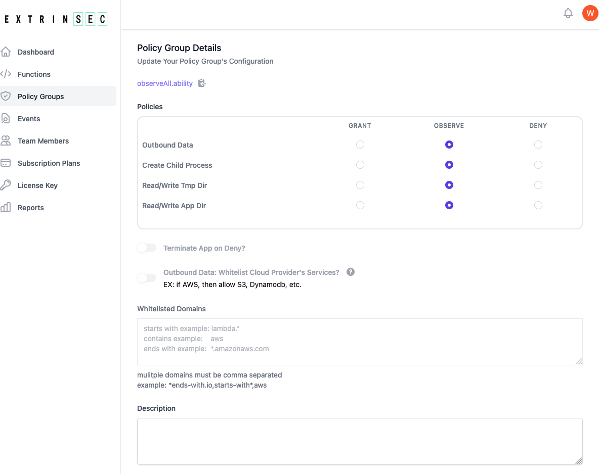

1. if you have a registered account, you can create and edit your own policy groups
1. if you have a temporary license key, please use the `observeAll.ability` public policy group, or register a free account
1. each policy group contains instructions for AppDefender during execution:
   1. __Grant__, __Observe__, or __Deny__ access to any combination of the following:
      1. outbound network traffic from the function/application process
      2. read/write on the /tmp/ or application directories
      3. create/spawn child processes
   2. whether to terminate function/application execution for any deny event
   3. whether to whitelist all cloud provider traffic if outbound data is set to deny.  _Note: this requires a paying billing plan_
      1. this is cloud provider specific, so if you are running on GCF and this option is set, all Google Cloud traffic would be allowed
   4. a list of whitelisted domains if outbound data is set to deny
      1. domain names are matched as contains by default, e.g. `stripe` would match `stripe.com` as well as `m.stripe.com`
      2. wildcards can also be used, e.g. `*.amazonaws.com` or `labmda.*`
      3. multiple domains are comma separated
      4. AppDefender performs DNS resolution to act on all IP addresses matching the specified domain names
   5. A optional description field for you to document the purpose or other details of the policy group
   
1. create as many policy groups as you have unique needs.  There is no limit on how many policy groups you may have
1. once a policy group is updated, the changes are automatically picked up by any configured AppDefender during the next invocation