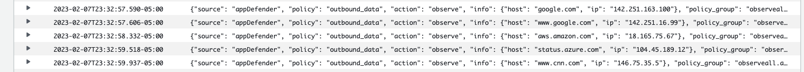

# Installation

_AppDefender can be added to your new or existing Lambda functions via a simple configuration change with no need for code changes or deployments._

## Prerequisites

1. a license key.  [Get one here](../how-to-get-a-license-key) if you don't already have one.
1. information about your AWS Lambda function:
   1. AWS region, e.g. `us-west-1`
   1. Lambda instruction set architecture, e.g. `x86_64` or `arm64`.  If you're not sure, then it's most likely the default, which is `x86_64`
   1. Note: AppDefender is supported for all the Amazon Linux 2 and Amazon Linux 2022 runtimes, but not those on Amazon Linux 1.  Reference our [support Matrix](../support-matrix.md) for more details.
1. permission to modify AWS Lambda environment variables and layer.  _Note: no code deployment is necessary_

## Configure AppDefender

1. add the `Extrinsec-Appdefender` extension as a layer to your Lambda, using the following ARN format
   - `arn:aws:lambda:<AWS_REGION>:201476247173:layer:Extrinsec-Appdefender:<EXTENSION_VERSION>`
     - replace `<AWS_REGION>` with your region (e.g. `us-east-1`) and `<EXTENSION_VERSION>` with the latest published version of our layer for your region, e.g. `arn:aws:lambda:us-east-1:201476247173:layer:Extrinsec-Appdefender:5`
       - [click here](<https://docs.extrinsec.com/aws-lambda-layers>) to view and copy the ARN for your region(s)
     - replace `Extrinsec-Appdefender` with `Extrinsec-Appdefender-arm64` if you are using arm64 runtimes
  
1. add the following environment variables to your Lambda
   - `ES_LICENSE_KEY=`your license key
   - `ES_POLICY_GROUP_NAME=`name of your policy group, use `observeAll.ability` if you have a temporary license key
   - `AWS_LAMBDA_EXEC_WRAPPER=/opt/extrinsec-appdefender.sh`, (this enables AppDefender)
   
1. see AppDefender in action in your CloudWatch logs or any logging service of your choice, e.g.
   

## Configure Policy Groups

import ConfigurePolicy from '../_configure_policy.md'

<ConfigurePolicy name='ConfigurePolicy'/>

## View Your Functions and Events

import ViewEvents from '../_view_events.md'

<ViewEvents name='ViewEvents'/>
