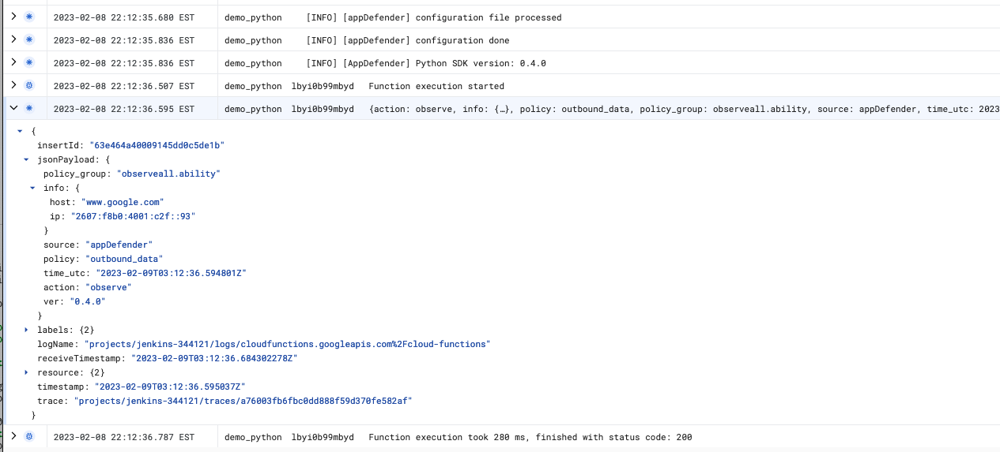

# Installation

## Pre-requisites

1. a license key.  [Get one](../how-to-get-a-license-key) if you don't have one already.
1. information about your Google Cloud function:
   1. [Cloud Functions execution environment](https://cloud.google.com/functions/docs/concepts/execution-environment), e.g. `Python 3.10`
   1. AppDefender is supported on Node.js, Python, Java, .NET, and Ruby GCF runtimes.  Reference our [support Matrix](../support-matrix.md) for more details.
1. permission to deploy a new version of your function with AppDefender enabled

## Configure AppDefender

### Install and import library

Import AppDefender as a dependency in your function/application based on your language, so GCF can download and install it during function deployment. Make sure to replace the version numbers below with the latest.  For local development, install the AppDefender packages from the public repositories for your runtime directly, e.g. `npm install @extrinsec/appdefender`

#### Node.js

1. update your `package.json` file to include the [AppDefender npm package](https://www.npmjs.com/package/@extrinsec/appdefender).  See [GCF documentation](https://cloud.google.com/functions/docs/writing/specifying-dependencies-nodejs) for more details.
   ```json title="package.json"
   {
      "main": "index.js",
      "dependencies": {
         ...
         "@extrinsec/appdefender": "latest"
      }
   }
   ```
1. import AppDefender in your function entry point script, e.g.
   ```js title="index.js"
   const appdefender = require('@extrinsec/appdefender');
   ```

#### Python

1. update your `requirements.txt` file to include the [AppDefender Python package](https://pypi.org/project/appdefender/).  See [GCP documentation](https://cloud.google.com/functions/docs/writing/specifying-dependencies-python) for more details.
   ```text title="requirements.txt"
   appdefender
   ```
1. import AppDefender in your function entry point script, e.g.
   ```python title="main.py"
   import appdefender
   ```

#### Ruby

1. update your `Gemfile` to include the [AppDefender RubyGem package](https://rubygems.org/gems/appdefender) and the required gem `ffi` for loading native libraries.  See [GCP documentation](https://cloud.google.com/functions/docs/writing/specifying-dependencies-ruby) for more details.
   ```json title="Gemfile"
   source "https://rubygems.org"

   gem "functions_framework", "~> 1.2"
   gem "appdefender", "~> 0.3"
   gem "ffi", "~> 1.15"
   ```
1. create `Gemfile.lock` to specify all the dependencies
   ```console
   $ bundle lock
   ```
1. load AppDefender in your function entry point script, e.g.
   ```ruby title="app.rb"
   require 'appdefender'
   ```

#### Java

1. update your project configuration file for your build system to include the [AppDefender Java package](https://search.maven.org/artifact/com.extrinsec/appdefender).  See [GCP documentation](https://cloud.google.com/functions/docs/writing/specifying-dependencies-java) for more details.  Sample Maven pom.xml file show below:
   ```xml title="pom.xml"
      <dependencies>
         <dependency>
            <groupId>com.extrinsec</groupId>
            <artifactId>appdefender</artifactId>
            <version>0.3.1</version>
         </dependency>
      ...
      <dependencies>
   ```
1. import and enable AppDefender in the handler method of your function entry point class, e.g.
   ```java title="MyFunction.java"
   import com.extrinsec.AppDefender;

   // enable appdefender in the handler function
   AppDefender.enable();
   ```

#### C#

1. update your project configuration file to include the [AppDefender Nuget package](https://www.nuget.org/packages/AppDefender).  See [GCP documentation](https://cloud.google.com/functions/docs/writing/specifying-dependencies-dotnet) for more details.
   ```xml title="MyProject.csproj"
   <Project Sdk="Microsoft.NET.Sdk">
      ...
      <ItemGroup>
         <PackageReference Include="AppDefender" Version="0.3.1">
            <IncludeAssets>all</IncludeAssets>
         </PackageReference>
      </ItemGroup>
   </Project>
   ```
1. import and enable AppDefender in the handler method of your function entry point class, e.g.
   ```csharp title="MyFunction.cs"
   using AppDefenderSDK;

   // enable appdefender in the handler function
   AppDefender.enable();
   ```


### Set environment variables

import SetEnvVars from '../_set_env_vars.md'

<SetEnvVars name='SetEnvVars'/>

   

### Invoke function

* Invoke your function and seee AppDefender in action in your logs
   

## Configure Policy Groups

import ConfigurePolicy from '../_configure_policy.md'

<ConfigurePolicy name='ConfigurePolicy'/>

## View Your Functions and Events

import ViewEvents from '../_view_events.md'

<ViewEvents name='ViewEvents'/>
