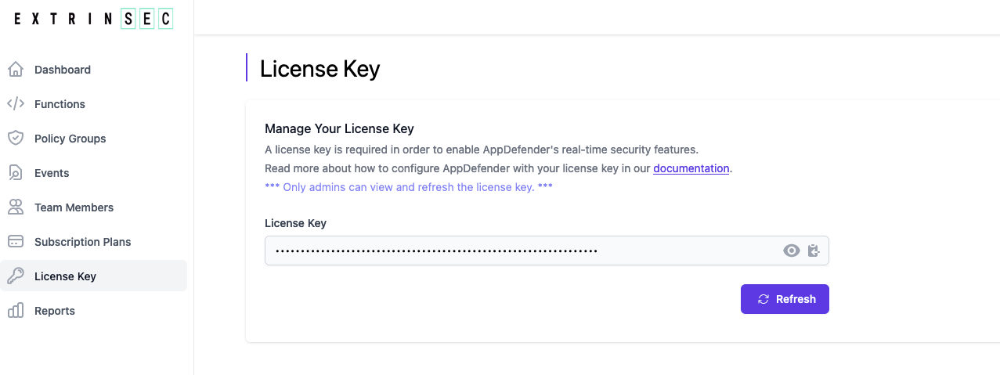

# License Key

A valid license key is required to enable AppDefender. We provide two types of license keys: temporary and permanent.  If you have an account, then you have a permanent, non-expiring license key.  If you requested and received a temporary license key, then you have a key with an expiring date.  Temporary keys are intended for quick evaluations and proof-of-concepts. Should you decide to move forward with our service, we recommend that you create a registered account and generate a permanent license key, which unlocks additional features not afforded to temporary license keys.

## Temporary License Key

1. all you need to get a temporary license key is a valid email address
1. [click here](https://www.extrinsec.com/try) to request a temporary license key
1. a temporary license key will be emailed to you
1. add the value of this key as an environment variable (`ES_LICENSE_KEY`) to your serverless functions/applications
1. limitations of the temporary license key:
   1. you may use it for up to three functions/applications
   1. the key expires after 30 days, starting the date of issue
   1. you can only use this key with publicly available policy groups, e.g. `observeAll.ability`, with no ability to customize
   1. you cannot view AppDefender events in our dashboard
   1. temporary license keys are meant for you to test drive AppDefender with the least amount of commitment

## Permanent License Key

1. a permanent license key is automatically generated when you register your free account
1. view, copy, or regenerate your license key under the __License Key__ section of the dashboard
   
1. add the value of this key as an environment variable (`ES_LICENSE_KEY`) to your serverless functions/applications
1. a permanent license key allows you to customize how to protect your serverless functions/applications, e.g. different configurations (policy groups) for different applications, or prevent certain traffic unique to your situations
1. a permanent license key does not expire, but is still subject to the limitations of your current billing plan

### Notes

1. AppDefender validates and obtains your plan features and limitations during application startup.  If you use an invalid or expired license key, then AppDefender will be disabled and your application won't be protect.  A warning of such is written to your application's log file.
1. only admin users can view and regenerate a license Key.
1. key regeneration immediately invalidates your prior license key and AppDefender will be disabled for any applications that start/restart with the old key.  Make sure to configure all of your serverless function and application with the new key ASAP.
1. there is no need to regenerate a license key if you upgrade/downgrade your billing plan
