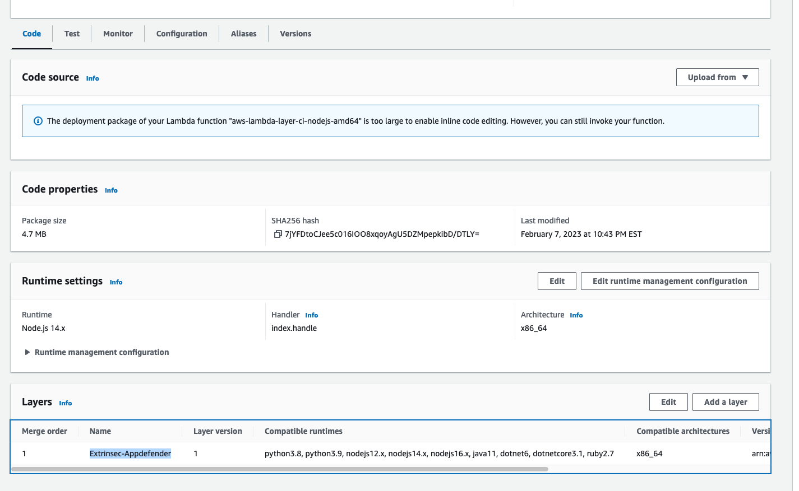
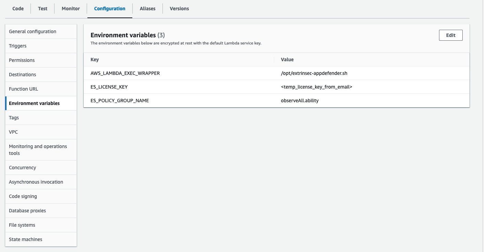
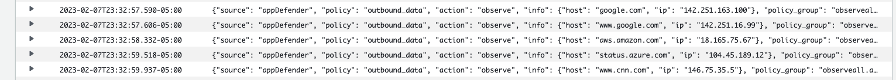

# Quick Start Guide

_This guide describes a quick and easy way to test out AppDefender on AWS Lambda.  For more customized usage, please see the various guides relevant to your cloud platform and language runtime._

1. [request](https://www.extrinsec.com/try) a temporary license key sent to your email address
1. add the `Extrinsec-Appdefender` extension as a layer to your Lambda, using the following ARN
   - `arn:aws:lambda:<AWS_REGION>:201476247173:layer:Extrinsec-Appdefender:<EXTENSION_VERSION>`
   - replace `<AWS_REGION>` with your region (e.g. `us-east-1`) and `<EXTENSION_VERSION>` with the latest published version of our layer for your region, e.g. `arn:aws:lambda:us-east-1:201476247173:layer:Extrinsec-Appdefender:5`
   - replace `Extrinsec-Appdefender` with `Extrinsec-Appdefender-arm64` if you are using ARM64 runtimes
   
1. add the following environment variables to your Lambda
   - `ES_LICENSE_KEY=`<the temporary license key you received in step 1>
   - `ES_POLICY_GROUP_NAME=observeAll.ability`, (this is the public policy group that observes and logs only)
   - `AWS_LAMBDA_EXEC_WRAPPER=/opt/extrinsec-appdefender.sh`, (this enables AppDefender)
   
1. see AppDefender in action in your CloudWatch logs or any logging service of your choice, e.g.
   

#### Notes

1. All you need to try AppDefender is a valid email address.  No additional information or credit card is required.
1. Your temporary license key has some usage limitations (can be used for up to 3 applications and expires after 30 days).
1. The publicly available policy group `observeAll.ability` allows you to see in your logs what AppDefender is able to protect against, e.g. outbound network traffic and subprocess creation.  But in order to customize for your environment and enable protection (deny certain traffic), you will need to register and create your own policies.
1. If you have previously requested a temporary license key using your email address, please [register an account](https://www.extrinse.com/signup) to continue to use our service.